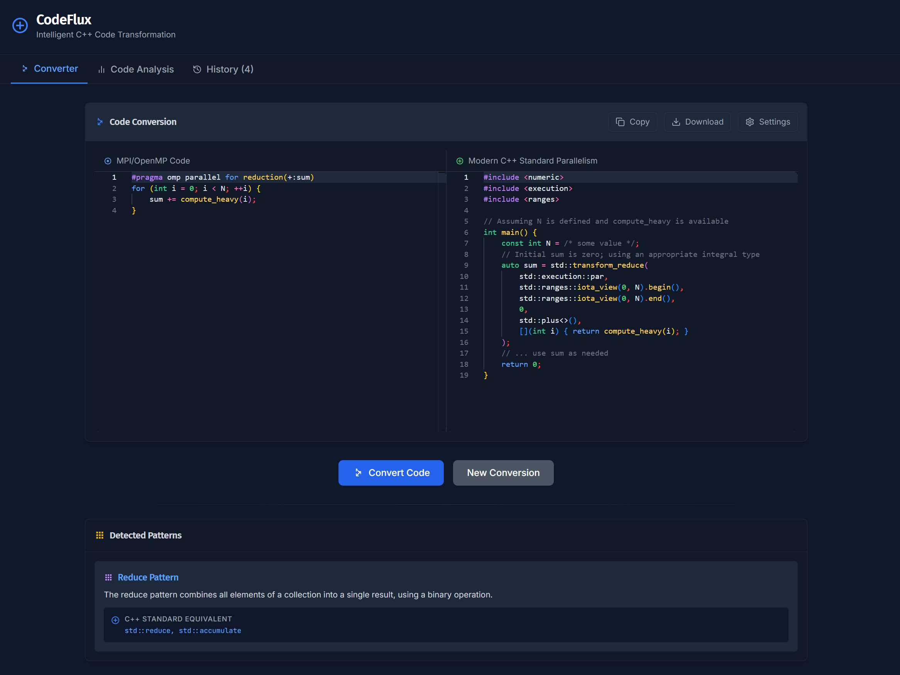

# CodeFlux: C++ Parallel Code Transformation Tool

CodeFlux is a modern web application that intelligently converts legacy MPI/OpenMP C++ code into cleaner, more maintainable C++ code using C++17/20/23 Standard Parallel Algorithms and execution policies.



## ✅ Current Features

- **Code Conversion:** Transform OpenMP/MPI code to modern C++ parallelism
- **Pattern Detection:** Automatically identify parallel patterns in code (Map, Reduce, Scan, etc.)
- **Performance Analysis:** Visualize performance improvements with detailed metrics
- **Code Comparison:** Side-by-side visualization of original and converted code
- **Explanation Generation:** Get detailed explanations of code transformations
- **Pattern Knowledge Base:** Access in-depth information about detected parallel patterns
- **Conversion History:** Save and review past conversions with their results
- **Customizable Settings:**
  - Target C++ version (17, 20, or 23)
  - Reasoning effort level
  - API key management
  - Explanation toggle

## 🧩 Architecture

The application is built with a modular structure:
- **React Components:** Clean separation of UI elements
- **Custom Hooks:**
  - `useConverter`: Handles code conversion logic
  - `usePatternDetection`: Detects parallel patterns in code
  - `useExplanation`: Manages explanations and pattern knowledge
  - `useHistoryManagement`: Handles conversion history storage and retrieval
- **Services:**
  - OpenAI API integration for code conversion and pattern knowledge generation
  - Performance data visualization
  - Code diff visualization

## 🚀 Getting Started

### Prerequisites

- Node.js (v16 or higher)
- npm or yarn
- OpenAI API key

### Installation

1. Clone the repository:
   ```bash
   git clone https://github.com/heshamfs/codeflux.git
   cd codeflux
   ```

2. Install dependencies:
   ```bash
   npm install
   ```

3. Start the development server:
   ```bash
   npm run dev
   ```

4. Open your browser and navigate to `http://localhost:5173`

### Environment Setup

1. Copy the example environment file:
   ```bash
   cp .env.example .env
   ```

2. Open the `.env` file in your editor and add your OpenAI API key:
   ```
   VITE_OPENAI_API_KEY=your_api_key_here
   ```

   Alternatively, you can enter your API key directly in the application.

### Usage

1. Enter your OpenAI API key in the settings panel (click the gear icon)
2. Configure your settings (C++ version, reasoning effort, etc.)
3. Paste your MPI or OpenMP code into the input panel
4. Click "Convert Code"
5. View the converted code, explanations, and performance metrics
6. Explore pattern knowledge for deeper understanding
7. Save conversion to history for future reference

> **Note**: Your API key is stored only in your browser's local storage.

## 📋 TODO List

- [ ] **Enhanced Error Handling:**
  - Add more robust error handling for API failures
  - Improve validation for input code
  - Add helpful error messages for malformed code

- [ ] **UI Improvements:**
  - Add a dark/light theme toggle
  - Improve mobile responsiveness
  - Add keyboard shortcuts for common actions
  - Add progress indicators for long operations

- [ ] **Documentation:**
  - Add detailed API documentation
  - Create user guide with examples
  - Add contributing guidelines

- [ ] **Pattern Knowledge Enhancement:**
  - Add more detailed pattern knowledge with examples
  - Improve visualization of patterns in code
  - Add links to relevant C++ documentation

- [ ] **Performance:**
  - Optimize rendering of large code blocks
  - Implement caching for common conversions
  - Add client-side debouncing for API calls

- [ ] **Testing:**
  - Add unit tests for core functionality
  - Implement integration tests for API interactions
  - Add end-to-end testing for critical user flows

- [ ] **Collaboration Features:**
  - Add code sharing capability
  - Implement export/import of conversion history
  - Add user accounts (optional)

- [ ] **Advanced Conversion Features:**
  - Add support for more complex MPI patterns
  - Implement suggestions for code optimization
  - Add interactive code editing after conversion

## 🔧 Technology Stack

- React
- TypeScript
- Tailwind CSS
- OpenAI API (gpt-4o model)
- Vite (for development and building)

## 📊 Example

### Input (OpenMP):
```cpp
#pragma omp parallel for reduction(+:sum)
for (int i = 0; i < N; ++i) {
    sum += compute_heavy(i);
}
```

### Output (C++20 Standard Parallelism):
```cpp
#include <numeric>
#include <execution>

auto sum = std::transform_reduce(
    std::execution::par,
    counting_iterator(0), counting_iterator(N),
    0.0,
    std::plus<>{},
    [](int i){ return compute_heavy(i); }
);
```

## 📄 License

This project is licensed under the MIT License - see the LICENSE file for details.

## 🤝 How to contribute

We welcome any friendly suggestions and helpful contributions! Just create issues or submit pull requests.

## 🙏 Acknowledgments

- [OpenAI](https://github.com/OpenAI) for their powerful models
- The C++ Standards Committee for the parallel algorithms library 